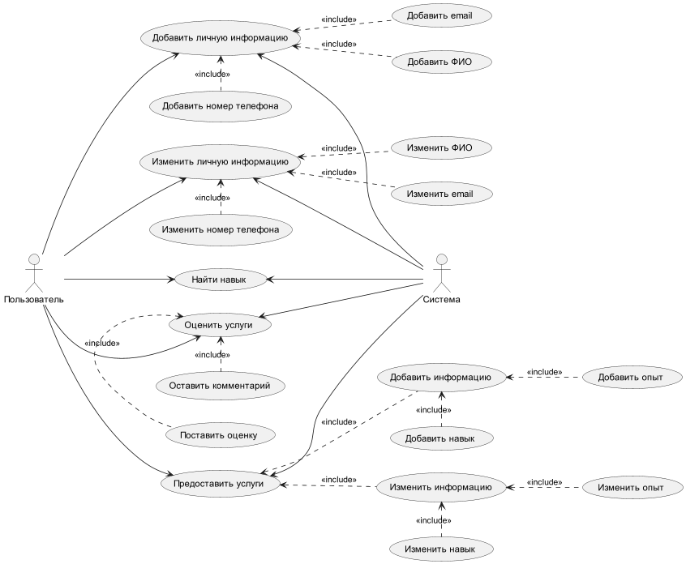
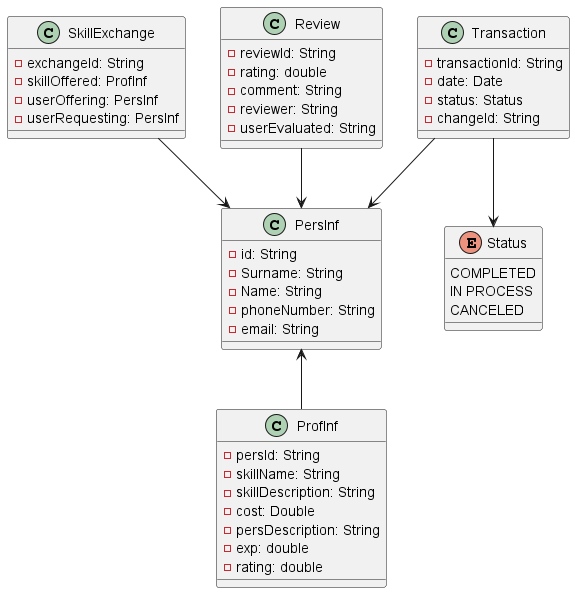
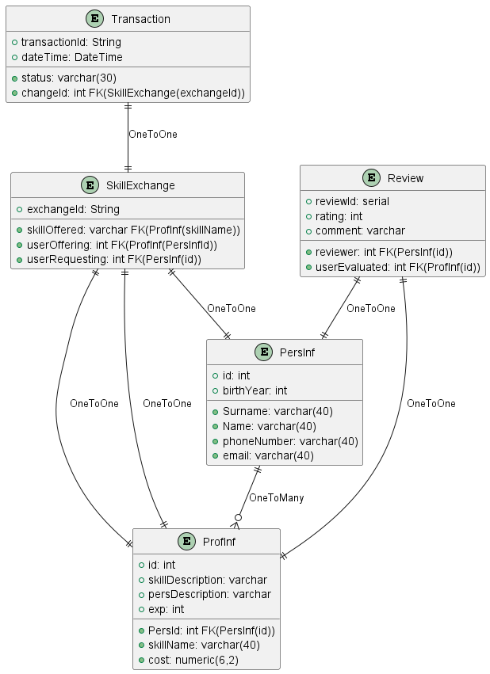
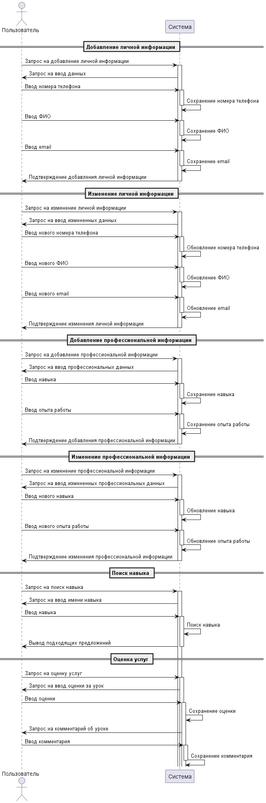

# SkillSwap

---
***Работа проекта:***

Консольное приложение SkillSwap предоставляет пользователям возможность найти/разместить навык,
по которому они хотят получить/провести урок. Доступ ко всем возможностям платформы получают пользователи прошедшие
первичную регистрацию. Все сделки между пользователями записываются в таблицы с определенным статусом:
*IN_PROCESS, CANCELED, COMPLETED*. В зависимости от статуса сделки, приложение предлагает
пользователю оставить отзыв о проведенном уроке(рейтинг + комментарий), которые после суммируются и
добавляются в данные к преподавателю.
---
В начале работы над проектом были составлены следующие UML-диаграммы: вариантов использования, классов, базы данных,
последовательности.
- Диаграмма вариантов использования:
  
- Диаграмма классов:
  
- Диаграмма базы данных:
  
- Диаграмма последовательности:
  
