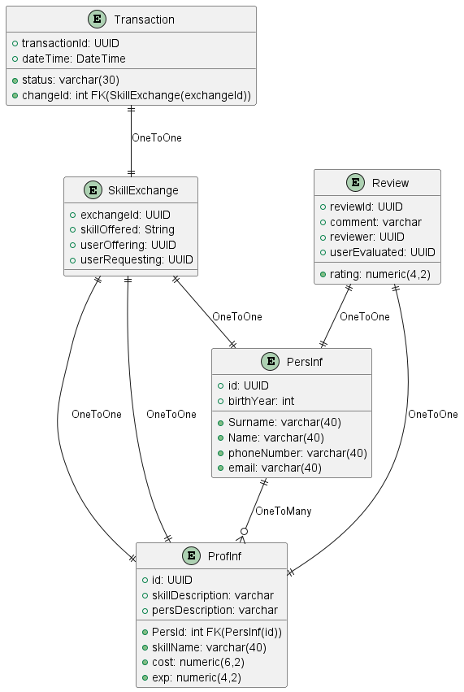

# SkillSwap v1.0

***Работа проекта:***

- Веб-приложение SkillSwap предоставляет пользователям возможность найти/разместить навык,
по которому они хотят получить/провести урок. 

- Доступ к платформе имеют пользователи прошедшие первичную регистрацию.(обычная аутентификация + 
ввод личных данных). Далее пользователь может либо найти необходимый навык, либо его разместить.
В целях обеспечения безопасности каждый пользователь может изменять только свои персональные данные.
Чтобы реализовать этот функционал из контекста безопасности Spring Security берется аутентифицированный
пользователь и его данные сравниваются с данными человека на платформе, если они совпадают, то доступ разрешен,
иначе - перенаправляют на страницу предупреждения.

- Для повышения удобства пользования платформой настроен метод поиска по названию навыка. Возможность изменять 
предоставляемые услуги(цену, описание), а также все личные данные. 

-  **v2.0**: После регистрации пользователям на адрес электронной почты приходит
приветственное письмо. В приложении будет находится отдельный микросервис, отвечающий за
почтовую рассылку. Общение между микросервисами происходит через Kafka. 

-  **v3.0**: В случае, если пользователь выбирает нужный 
навык и хочет связаться с лицом, предоставляющим услуги, платформа предоставит личные данные, а также откроет 
транзакцию в статусе IN_PROCESS. В зависимости от статуса сделки (CANCELED, COMPLETED), будет предложено оставить 
комментарий и оценить своего наставника. Рейтинг суммируется к преподавателю и складывается на основе всех оценок,
чтобы пользователи могли выбирать качество предоставляемых услуг.

---
В начале работы над проектом были составлены следующие UML-диаграммы:
- Диаграмма вариантов использования

  
- Диаграмма классов

  
- Диаграмма базы данных

  
- Диаграмма последовательности

  

---

### Использованные технологии:
1. Java 
2. Spring
3. Spring Boot 
4. Spring Security 
5. Spring Validator
6. Spring Data
7. Spring Mail
8. Kafka(v2.0)
9. Docker(v3.0)
10. Hibernate
11. PostgreSQL
12. Flyway
13. HTML, CSS, Thymeleaf
14. Maven
---
