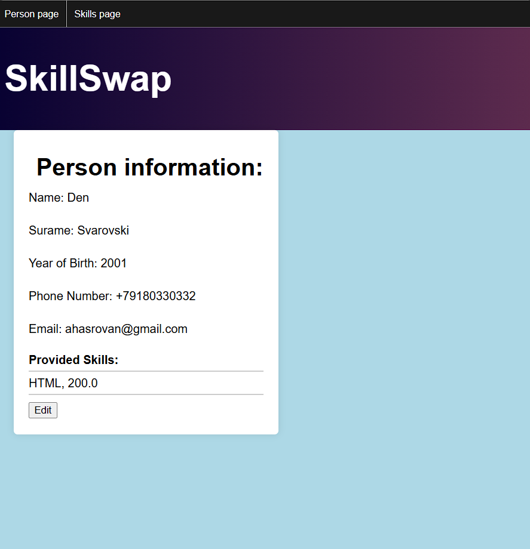
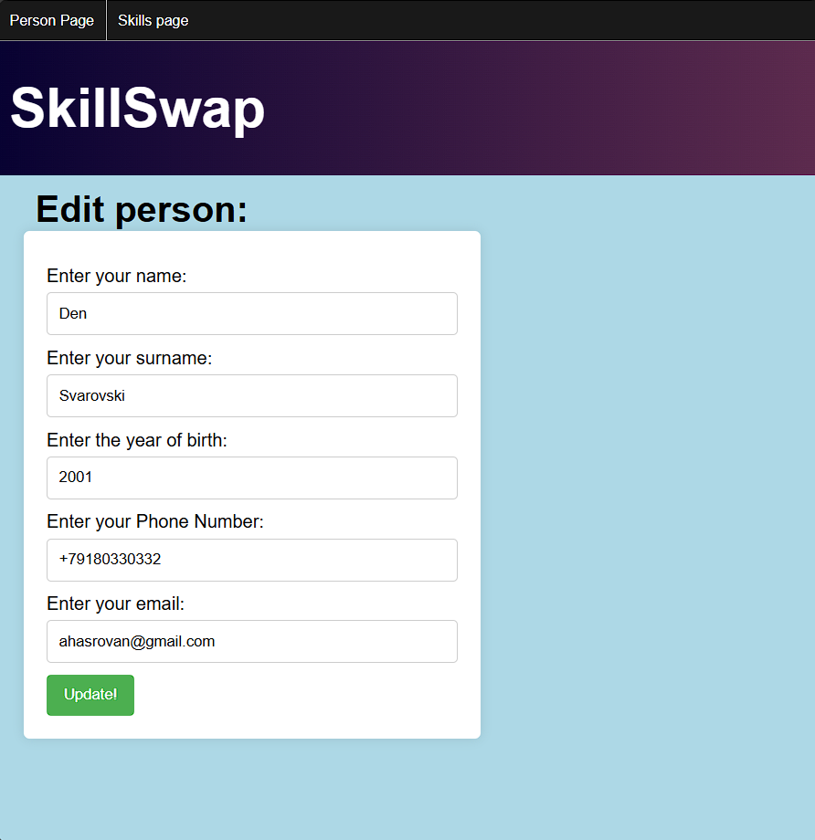

# SkillSwap v3.0

***Работа проекта:***

- Веб-приложение SkillSwap предоставляет пользователям уникальную возможность находить или размещать навыки,
  по которым они хотят получить или провести урок. 

- **v2.0**: Архитектура системы построена на основе двух микросервисов. Первый отвечает за реализацию ключевых 
функций приложения, а второй обеспечивает рассылку уведомлений по электронной почте. Пользователи получают 
приветственное письмо после регистрации, а также оповещения, если кто-то заинтересовался их предложением. 
Взаимодействие между микросервисами осуществляется через брокер сообщений Kafka.

- Доступ к платформе предоставляется только после прохождения первичной регистрации, включающей стандартную 
аутентификацию и ввод личных данных. После этого пользователь может либо найти нужный навык, либо предложить 
свой. В целях безопасности каждый пользователь имеет право изменять только свои персональные данные. Для 
реализации этого функционала используется Spring Security: система сравнивает данные аутентифицированного 
пользователя из контекста с данными на платформе. Если они совпадают, доступ разрешен; в противном случае пользователь 
перенаправляется на страницу с предупреждением.
  

- Для удобства пользователей на платформе реализован поиск по названию навыка. Также предусмотрена возможность 
редактирования предлагаемых услуг (цены, описания) и личных данных. 

-  **v3.0**: Если пользователь выбирает навык и желает связаться с его обладателем, платформа предоставляет 
контактные данные и открывает транзакцию со статусом IN_PROCESS. В зависимости от итогового статуса сделки 
(CANCELED или COMPLETED), пользователю предлагается оставить отзыв и оценить наставника. Рейтинг преподавателя 
формируется на основе всех полученных оценок, что помогает другим пользователям выбирать качественные услуги. 
Чтобы предотвратить накрутку рейтинга, система проверяет, что сделка заключается между разными пользователями. 
В случае попытки обмана система перенаправляет на страницу с предупреждением.

 - **Обработка ошибок**: Все действия в приложении логируются. В случае возникновения ошибки, она передается 
на уровень контроллера, где обрабатывается, а пользователь видит страницу с предложением повторить попытку.

---
В начале работы над проектом были составлены следующие UML-диаграммы:
- Диаграмма вариантов использования

  
- Диаграмма классов

  
- Диаграмма базы данных

  
- Диаграмма последовательности

  

---

### Использованные технологии:
1. Java 
2. Spring
3. Spring Boot 
4. Spring Security 
5. Spring Validator
6. Spring Data
7. Spring Mail
8. Kafka
9. Docker
10. Hibernate
11. PostgreSQL
12. Flyway
13. HTML, CSS, Thymeleaf
14. Maven
15. Slf4j
16. Flyway
---
### Интерфейс приложения:

1. В начале пользователей встречает приветственная страница и просит пройти регистрацию.
   
    
- Регистрация

  
- Вход в систему + демонстрация валидации

  
- Ввод личных данных

  
- Валидация личных данных

  
- Приветственное письмо

  

2. После прохождения регистрации и аутентификации пользователь имеет полный
доступ к платформе и ее содержимому.
- Пользователи приложения

  
- Просмотр чужих личных данных

  
- Просмотр своих личных данных

  
- Изменение личных данных

  
- Страница с навыками

  
- Добавление профессиональных данных(для преподавателей)

  
- Изменение профессиональных данных(для преподавателей)

  
3. Далее пользователь может найти нужный навык, связаться с преподавателем
и в случае успеха оставить ему отзыв.
- Поиск навыка

  
- Просмотр данных навыка

  
- Страница личных контактов

  
- Письмо с оповещением о заинтересованности в предоставляемом навыке

  
- Попытка сделать сделку самому с собой

  
- Случай, если сделка не состоялась

  
- Случай, если сделка состоялась

  
- Страница после отправки отзыва

  
4. Обработка ошибок
- Страница, появляющаяся при возникновении ошибки
  
